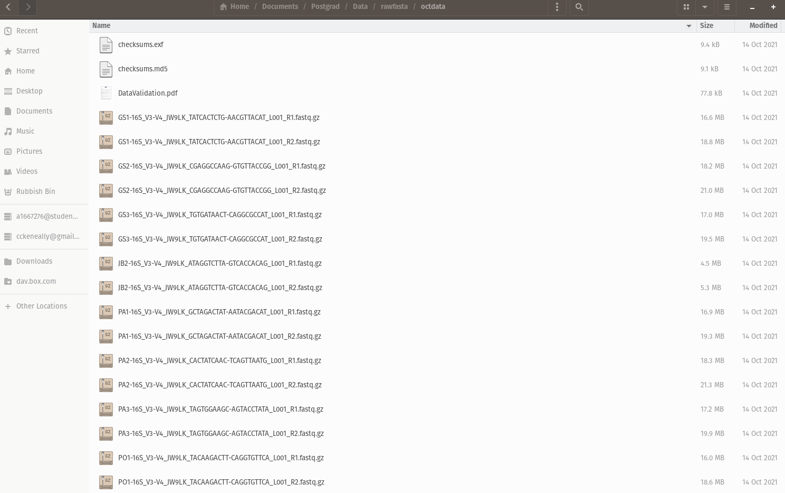
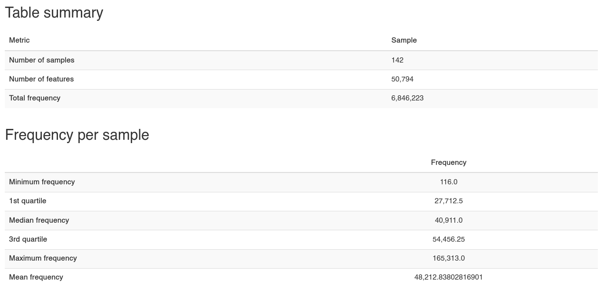
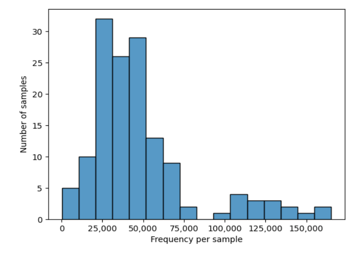
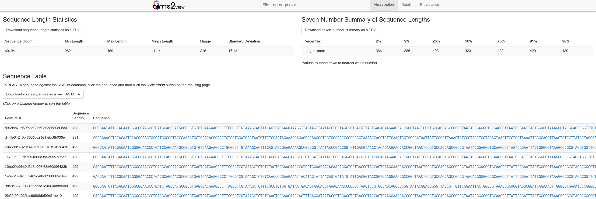
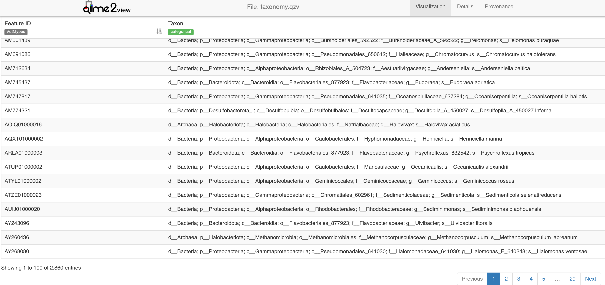
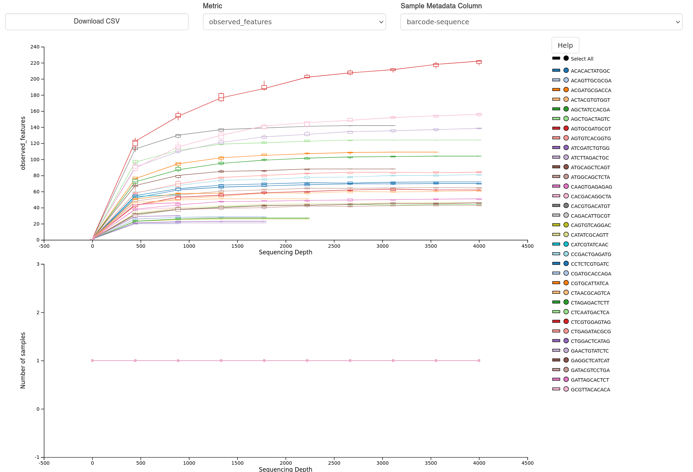
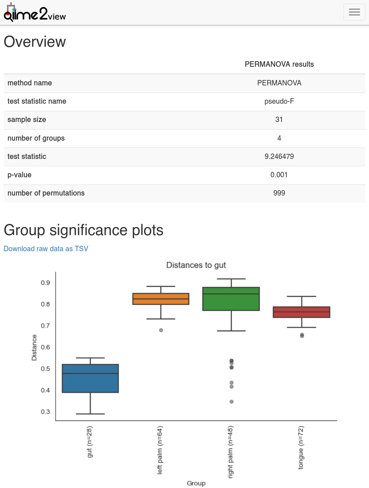

# From Sequences To Microbes: Foundations of QIIME2 and Bash for Environmental Microbiome Analysis
{: .fs-9 .no_toc }

New release
{: .label .label-purple }

Chris Keneally - PhD Candidate, Freshwater & Ecophysiology, School of Biological Sciences, The University of Adelaide, South Australia
{: .fs-6 .fw-300 }

[christopher.keneally@adelaide.edu.au](mailto:christopher.keneally@adelaide.edu.au)

------------------------------------------------------------------------

<details closed markdown="block">
  <summary>
    Table of contents
  </summary>
  {: .text-delta }
- TOC
{:toc}
</details>

------------------------------------------------------------------------

# Introduction

In this tutorial, we'll explore the basics of bioinformatic processing of Next-Generation Sequencing (NGS) data, specifically focusing on 16S amplicon sequence analysis. This guide is especially useful for environmental microbiome research. We'll utilize [QIIME2](https://qiime2.org/)(**Q**uantitative **I**nsights **I**nto **M**icrobial **E**cology), a versatile and commonly-used tool for microbiome data analysis, and incorporate some essential Bash skills for efficient navigation and data handling .

The tutorial covers basic workflow of NGS data analysis (post-demultiplexing): starting from setting up the QIIME2 environment, importing and assessing data quality, to denoising with DADA2, taxonomic classification, and some examples of basic statistical analyses. Each section is structured with step-by-step instructions and code snippets to ensure clarity and ease of understanding.

This data displayed here is based on analysis conducted for a PhD chapter on seasonal fluctuations of sediment microbial communities in the Coorong Lagoon, in South Australia. While QIIME2 itself provides extremely [comprehensive tutorials](https://docs.qiime2.org/), this guide serves as a practical supplement, demonstrating an application on real-world, imperfect environmental data from the perspective of an ecologist.

This is not a replacement for the official QIIME documentation - but serves as a guide and framework for anyone who finds it useful. *(probablyy me when I inevitably forget what I've done in 3 years... )*

## Basics of Bash

Bash (**B**ourne **A**gain **Sh**ell) is a powerful command-line interface used in many operating systems for file manipulation, program execution, and other tasks. It's an essential tool for bioinformaticians, providing a direct way to interact with the system and automate tasks.

Bash is more than just a program to run commands; it's a scripting language that allows you to write scripts to automate complex tasks. Once you are comfortable using it, this can significantly increase your productivity, especially in data-heavy fields like bioinformatics. Alongside R and Python, Bash is a core skill for bioinformatics.


## Accessing Bash in Different Operating Systems

### Windows

-   Windows Subsystem for Linux (WSL): Windows users can access Bash through WSL, a compatibility layer for running Linux binary executables natively on Windows. Windows provides a [guide](https://learn.microsoft.com/en-us/windows/wsl/install) to access this.

-   [Docker](https://www.docker.com/): A tool that lets you run applications in isolated environments, known as containers. On Windows, it can be used to access a Linux-based Bash shell, providing a convenient way for Windows users to run Linux-specific applications or scripts.

### macOS

Terminal: macOS users have direct access to Bash through the Terminal application. It comes pre-installed and can be found in the Utilities folder, or you can search for it using Spotlight.

### Linux

Terminal: On Linux, Bash is usually the default shell. You can access it through the Terminal application, which is included in all Linux distributions.

This was written on a linux machine running [Pop OS](https://pop.system76.com/), so examples of folder hierarchies may look a bit different to those on your Windows or Mac OS while following along.

## Basic Bash Navigation Commands

Navigating through your files (copying, moving, opening folders etc.) is performed with text commands. Here are some basic commands, vital to this tutorial:

-   `pwd` (Print Working Directory): Shows the directory you are currently in.

-   `ls` (List): Lists files and directories in the current directory.

-   `cd` (Change Directory): Used to move between directories.

-   `mkdir` (Make Directory): Creates a new directory.

-   `rm` (Remove): Deletes files or directories.

-   `cp` (Copy): Copies files or directories.

-   `mv` (Move): Moves or renames files or directories.

-   `echo`: Displays a line of text/string that is passed as an argument.

-   `grep`: Searches for patterns in files.

-   `cat`: Concatenates and displays the content of files.

## Learning Advanced Bash Skills

If you are keen to delve deeper into Bash and learn more advanced skills, you can explore the following resources:

[GNU Bash Reference Manual](https://www.gnu.org/software/bash/manual/bash.html): The official documentation for Bash.

[Codecademy's Learn the Command Line Course](https://www.codecademy.com/learn/learn-the-command-line): An interactive platform for learning basic to advanced Bash commands.

[Linux Command Line Basics on Udacity](Linux%20Command%20Line%20Basics%20on%20Udacity:%20A%20course%20focused%20on%20Linux%20command%20line%20basics.%20Advanced%20Bash-Scripting%20Guide:%20An%20in-depth%20exploration%20of%20Bash%20scripting.): A course focused on Linux command line basics.

[Advanced Bash-Scripting Guide](https://tldp.org/LDP/abs/html/): An in-depth exploration of Bash scripting.

Bash is an extremely powerful tool in the hands of a skilled user. By mastering Bash, you can automate repetitive tasks, manage files and directories more efficiently, and streamline your data processing workflows.

# Setup

First of all you should install [conda](https://conda.io/projects/conda/en/latest/index.html), a package manager which allows you to compartmentalise various software. Please see the [QIIME2 documentation for installation help](https://docs.qiime2.org/2023.9/install/). This guide covers installation of both conda and QIIME2 for any given OS very comprehensively.

## Activate QIIME2 environment

Open a bash terminal & navigate to a directory (folder) you'd like to work in with the 'change directory' command `cd`

``` bash
cd /path/to/directory
conda activate qiime2-2023.5
```

------------------------------------------------------------------------

# Import Seqs

{: .warning }
This guide does not cover demultiplexing and assumes that you have demultiplexed .fastq files for each of your samples!

There are some great demultiplexing tutorials available in the [QIIME docs](https://forum.qiime2.org/t/demultiplexing-and-trimming-adapters-from-reads-with-q2-cutadapt/2313). Although this is an important part of the bioinformatic process - many service providers (AGRF in Australia, for example), will provide you with something like this:


*A folder of demultiplexed .fastq sequences as provided by AGRF*


To import these into QIIME, we need to make a manifest (this bash script written for my specific case may be useful):

<details>
<summary><b>update_manifest.sh</b></summary>


#!/bin/bash

# This script is designed to search a directory for PHRED33v2 format paired end sequences and append to a manifest file in csv format
# Works for paired-end seqs provided by AGRF microbial profiling service but may need tweaking otherwise
# The CSV file must have the following column names before running:
# sampleid,forward-absolute-filepath,reverse-absolute-filepath
# To use this script:
# 1) Make it executable:
# $ chmod +x update_manifest.sh
# 2) Run the script with the path to the directory where sequences are stored, and the path to manifest.csv as arguments:
# $ ./update_manifest.sh /path/to/your/directory /path/to/your/manifest.csv

# Directory provided as the first argument
DIRECTORY=$1

# Path to the CSV manifest file provided as the second argument
MANIFEST=$2

# Check if the manifest file exists; if not, create it and add the header
if [ ! -f "$MANIFEST" ]; then
    echo "Creating new manifest file with headers."
    echo "sampleid,forward-absolute-filepath,reverse-absolute-filepath" > "$MANIFEST"
elif [ ! -s "$MANIFEST" ]; then
    echo "Existing manifest file is empty. Adding headers."
    echo "sampleid,forward-absolute-filepath,reverse-absolute-filepath" > "$MANIFEST"
fi

# Iterate over R1 files in the specified directory
for R1 in "$DIRECTORY"/*_R1.fastq.gz; do
    # Corresponding R2 file
    R2="${R1/_R1.fastq.gz/_R2.fastq.gz}"

    # Check if R2 file exists
    if [ -f "$R2" ]; then
        # Extract sample ID from R1 filename
        SAMPLEID=$(basename "$R1" | sed 's/-16S_V3-V4_.*//')

        # Append to CSV manifest
        echo "\"$SAMPLEID\",\"$R1\",\"$R2\"" >> "$MANIFEST"
    fi
done


</details>

\
To use this script, you can run a command line text editor like '[nano](https://www.nano-editor.org/)' by typing `nano` into bash (there are other CLI text editors, but this is one available on most linux distros + mac OS, and is easier to use).

1.  Paste the script into nano and exit CTRL+X.

2.  Nano will ask you if you want to save the file, press Y

3.  Nano will ask you to name the file, call it `update_manifest.sh`

4.  Now you can make the file executable with this command:

`chmod +x update_manifest.sh`

5.  Replace the placeholder path in the code below with the directory containing your sequences, then run the code. The script will create a new manifest (if none is present), or append new sequences to an exisiting manifest. This can be run for multiple folders, and will append sequences iteratively.

``` bash
./update_manifest.sh /path/to/seq/directory \
~/SeasonalAnalysis/QIIME2/se-33-manifest-test.csv
```

The resulting `se-33-manifest-test.csv` file is a paired end .fastq manifest (Phred 33V2) which will import paired end reads into single samples with `qiime tools import`.

Input requires .tsv file, can convert from .csv with a one-liner:

`sed 's/,/\t/g' se-33-manifest-test.csv > se-33-manifest-test.tsv`

Run with the tsv

``` bash
qiime tools import \
  --type 'SampleData[PairedEndSequencesWithQuality]' \
  --input-path se-33-manifest-test.tsv \
  --output-path paired-end-demux-test.qza \
  --input-format PairedEndFastqManifestPhred33V2
```

## Visualise sequences

``` bash
qiime demux summarize \
--i-data paired-end-demux-test.qza \
--o-visualization paired-end-demux-test.qzv
```


*Sequence quality of forward & reverse reads from `paired-end-demux.qzv`, visualised in browser with the QIIME2 View tool*


------------------------------------------------------------------------

# Denoising w/ DADA2

DADA2 is an open-source package for modelling and correcting errors in Illumina-sequenced data, it is implemented in QIIME2, and generally considered to be the current gold-standard for microbial community analyses .

First of all, we need to remove primers. In this example I trimmed both FWD and REV primers by their length (high non-chimeric reads below suggests this trimming is sufficient, but `cutadapt` may be necessary if you are losing a lot of sequences to chimeras).

Next, we want to truncate off the poorer quality tail of the sequences (quality generally decreases with length due to sequencing limitations). A good rule of thumb for V3-V4 sequences is to truncate off sequences with a quality score \<18, as shown in . We must also ensure adequate length for overlap & merging - but what is adequate?

Based on quality cutoffs (visualised in `paired-end-demux-test.qzv` above), **280 nt** is a decent place to truncate forward reads, and **250** for our (lower quality) reverese reads. The V3-V4 region is **approx. 450bp** and a minimum **20nt overlap** is required for DADA2. Along with our primer lengths (18 & 20nt, respectively), we can calculate our overlap:

\$\$(F - FP) + (R - RP)  - A\$\$

Where \$ F \$ & \$ R \$ are forward and reverse sequence lengths, $FP$ & $RP$ are forward and reverse primer lengths, & $A$ is total amplicon length. In this case we have an (adequate) overlap of 42 nucleotides:

\$\$(262 + 230) - 450 = 42\$\$

Which *should* be sufficient for DADA2 to merge our reads. For the V3-V4 region in general, I have had the most success when aiming for a combined truncation length of 480 nts or higher.

``` bash
qiime dada2 denoise-paired \
  --i-demultiplexed-seqs paired-end-demux-test.qza \
  --p-trim-left-f 18 \
  --p-trim-left-r 20 \
  --p-trunc-len-f 280 \
  --p-trunc-len-r 250 \
  --o-table table.qza \
  --o-representative-sequences rep-seqs.qza \
  --o-denoising-stats denoising-stats.qza
```

`table.qza` is a QIIME artifact containing our feature table (counts of each sequence), `rep-seqs.qza` is a containing representative sequences, and `denoising-stats.qza` gives us a lot of information about what DADA2 just did to our input sequences. We

## Summarise and visualise denoising results

``` bash
qiime metadata tabulate \
  --m-input-file denoising-stats.qza \
  --o-visualization denoising-stats.qzv
```

`denoising-stats.qzv` is extremely useful for quality control of your DADA2 run (see below). The data shown here will allow you to troubleshoot low read counts. For example, if you notice many of your samples are losing sequences during filtering (low % input passed filter), it may be worth truncating your reads more - DADA2 will discard reads with \>2 expected errors.

When losing a lot of seqs during merging (low values in % input merged column):

1.  You might need a larger overlap - truncate less off the seqs.

2.  Low sequence quaity (particularly with long amplicons) may cause issues. DADA2 is quite conservative with calling errors and discarding sequences, you might consider using a different denoising/clustering method.

In our example below, we are losing some sequences to the merging stage - an acceptable amount in my case, but YMMV.

If many reads are lost to chimeras (% input non-chimeric):

1.  In most cases this is due to improper removal of primers, you may need to go back and look at the actual .fastq sequences being passed to DADA2 - do they still have primer sequences at the beginning of the read?

In this case, we are losing a small amount of sequences here - indicating our primer trimming is likely an okay approach.

In some cases - this troubleshooting process can be tricky, particularly when working with less common genes (e.g. fungal ITS). If you are really lost I strongly recommend getting onto the [QIIME2 forums](https://forum.qiime2.org/) and posting about your specific problem, there is a wealth of knowledge on there!


*Denoising statistics - from `denoising-stats.qzv` visualised with QIIME2View*

## Visualise table in context of environmental metadata

When summarising the ASV table, we can add environmental context with a metadata table - `sample-metadata.tsv` in this case.

Metadata is "data that describes other data" and is essential to analysing microbiomes in context. To function in QIIME, they must be formatted in a specific way. Here's an example from QIIME's "[Moving Pictures](https://docs.qiime2.org/2023.9/tutorials/moving-pictures/)" tutorial:


*QIIME-compatible metadata table example.*

To check your own metadata is formatted correctly for use in QIIME2, you can use [keemei](https://keemei.qiime2.org/) - a tool implemented in Google Sheets. Then, visualise:

``` bash
qiime feature-table summarize \
  --i-table table.qza \
  --o-visualization table.qzv \
  --m-sample-metadata-file sample-metadata.tsv
```


*Table summary & Freq/Sample - `table.qzv`*

Our data is made up of 142 samples, 50,794 individual 'features,' which collectively occur 6,846,223 times (frequency) in total, across the whole dataset. In our case these features are ASVs (**A**mplicon **S**equence **V**ariants) - if you use a method other than DADA2 these could (for example) represent **O**perational **T**axonomic **U**nits (OTUs) (where sequences are clustered together at a threshold of similarity.

We also get some summary statistics, and an automated plot of frequency per sample:


*Frequency per sample plot - `table.qzv`*

There is also an 'interactive sample detail' app which allows you to check the effect of a given even sampling (rarefaction) depth in light of your metadata variables. This will be important for choosing an even sampling depth if you intend to "rarefy" your data and want to check which samples will be dropped.

```         
qiime feature-table tabulate-seqs \
  --i-data rep-seqs.qza \
  --o-visualization rep-seqs.qzv
```

Clicking a representative sequence here allows you to BLAST the gene against the NCBI database - at this stage you have enough info to identify prevalent ASVs (in `table.qzv`) and identify them with BLAST (from `rep-seqs.qsv`).

Here, we have found that the ASV with the highest frequency in our data corresponds to the NCBI sequence for *Pseudoalteromonas agarivorans* - a marine bacterium! An initial sanity check passed on the data (sequenced from an estuarine environment)!

Doing this for \~50k other ASVs, however is... not advised - which is why we will go over taxonomy assignment next.


*Representative Sequences Visualisation - `rep-seqs.qzv`*


*NCBI blast top hit - following the link of the most prevalent ASV in `rep-seqs.qzv`*

------------------------------------------------------------------------

# Taxonomy Assignment

A new (at time of writing) taxonomy database has been released integrating shotgun metagenomic data and traditional 16S databases, called Greengenes2 . We will attempt to assign taxonomy using this new database.

## Installation of Greengenes 2 plugin for QIIME2

``` bash
conda activate qiime2-2023.5
pip install q2-greengenes2
# run qiime command to cache environment and add new features to qiime2
qiime greengenes2 
```

We also need to download the (full length 16S) backbone seqs for GG2, and the GG2 taxonomy

``` bash
wget http://ftp.microbio.me/greengenes_release/2022.10/2022.10.backbone.full-length.fna.qza

wget http://ftp.microbio.me/greengenes_release/2022.10/2022.10.taxonomy.asv.nwk.qza
```

## GG2 Phylogenetic taxonomy

Map data to backbone, then assign taxonomy to mapped table:

``` bash
#Mapping
qiime greengenes2 non-v4-16s \
    --i-table table.qza \
    --i-sequences rep-seqs.qza \
    --i-backbone 2022.10.backbone.full-length.fna.qza \
    --p-threads 0 \
    --o-mapped-table seqs.gg2.biom.qza \
    --o-representatives seqs.gg2.fna.qza
#Assign Taxonomy    
qiime greengenes2 taxonomy-from-table \
     --i-reference-taxonomy 2022.10.taxonomy.asv.nwk.qza \
     --i-table seqs.gg2.biom.qza \
     --o-classification seqs.gg2.taxonomy.qza
# Visualise
qiime metadata tabulate \
  --m-input-file seqs.gg2.taxonomy.qza \
  --o-visualization taxonomy.qzv \
```

Of our \~50k taxa, this method has only assigned some \~2000. While this method does show increased correlation with whole genome shotgun data at the species level , we are losing a lot of information here (and for this analysis of population trends across a large dataset, that level of specificity is not required). Let's try another method.


*`taxonomy.qzv` - Visualising results of taxonomy assignment with phylogenetic GG2 method*

## Naive bayes classification of taxonomy

Here we will assign taxonomy with QIIME2's `q2-feature-classifier` plugin , using naive bayes classifiers - trained on:

1.  The 'new' Greengenes2 database

2.  Silva v138


**Greengenes2**

One way to approach this is to trim the `2022.10.backbone.full-length.fna.qza` backbone seqs to [our region of interest specifically](https://forum.qiime2.org/t/how-to-train-the-classifier-for-v3-v4-region-with-99-identity-using-full-length-seuqnces-from-new-relase-of-greengenes-2022/27991/7). Or we can use a classifier trained on full-length 16S. For this method we use our `rep-seqs.qza` as input directly.

Download naive bayes classifier trained on GG2 16S full length seqs & classify:

``` bash
wget http://ftp.microbio.me/greengenes_release/2022.10/2022.10.backbone.full-length.nb.qza

qiime feature-classifier classify-sklearn \
  --i-classifier 2022.10.backbone.full-length.nb.qza \
  --i-reads rep-seqs.qza \
  --o-classification sklearn_taxonomy_gg2.qza 

qiime metadata tabulate \
  --m-input-file sklearn_taxonomy_gg2.qza \
  --o-visualization sklearn_taxonomy_gg2.qzv
```

**Silva v138**

For the silva classification I'll use a custom classifier available for download [here](https://github.com/cckeneally/q2-2021.8_silva132_16S_V3V4_classifier):

``` bash
qiime feature-classifier classify-sklearn \
  --i-classifier silva-138-99-nb-weighted-classifier.qza \
  --i-reads rep-seqs.qza \
  --o-classification sklearn_taxonomy_s138.qza 

qiime metadata tabulate \
  --m-input-file sklearn_taxonomy_s138.qza \
  --o-visualization sklearn_taxonomy_s138.qzv
```

In both cases, all taxa have been classified - this is because the bayesian method assigns taxonomy to the closest match. As such we get a 'Confidence' %, those below 70% are not assigned.

Here, the GG2 classifier has resulted in a higher proportion of low confidence (Unassigned) sequences, but we can compare the two taxonomies in our downstream analysis.


*`sklearn_taxonomy_s138.qzv` - Visualising results of taxonomy assignment with naive bayes method.*

------------------------------------------------------------------------

# Basic Analyses

Now we can do some initial analysis. You can import the various .qza files into R to use a massive amount of microbiome analysis packages implemented in R (by using a package like [QIIME2R](https://github.com/jbisanz/qiime2R)). However, QIIME2 has its own plugins for a quick initial analysis.

## Diversity

For phylogenetic diversity - we can make a sequence alignment and generate trees (rooted and unrooted) with `qiime phylogeny`:

``` bash
qiime phylogeny align-to-tree-mafft-fasttree \
  --i-sequences rep-seqs.qza \
  --o-alignment aligned-rep-seqs.qza \
  --o-masked-alignment masked-aligned-rep-seqs.qza \
  --o-tree unrooted-tree.qza \
  --o-rooted-tree rooted-tree.qza
```

I prefer to use R to run all analysis hereafter, but here are some examples of the diversity analyses you can run directly with QIIME (.qzv's taken from the '[Moving Pictures](https://docs.qiime2.org/2023.9/tutorials/moving-pictures/)' tutorial, which also has the code).

### Alpha Diversity

Shannon diversity, faith's phylogenetic diversity, observed features, and community evenness are default metrics computed by `qiime diversity core-metrics-phylogenetic`


*Alpha diversity visualisation example - Rarefaction curves.*

### Beta Diversity

Jaccard, bray-curtis, and unifrac (weighted + unweighted) are default metrics computed by `qiime diversity core-metrics-phylogenetic`


*Beta diversity vis. example - Unweighted unifrac ordination visualised with QIIME emperor.*


*Beta diversity group significance analysed by PERMANOVA and plotted with QIIME2 view.*

------------------------------------------------------------------------

# References


